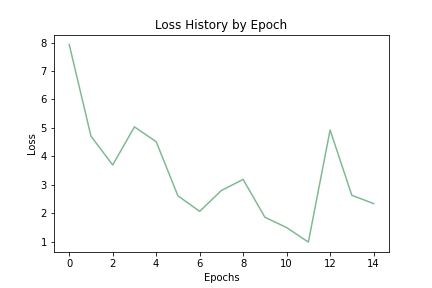
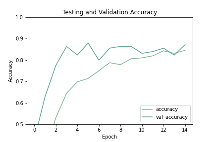

# Pneumonia Detection: A Computer Vision Study

## Our Data

Our dataset for this problem was provided on [Kaggle](https://www.kaggle.com/paultimothymooney/chest-xray-pneumonia).

> There are 5,863 X-Ray images (JPEG) and 2 categories (Pneumonia/Normal). <br>
Chest X-ray images (anterior-posterior) were selected from retrospective cohorts of pediatric patients of one to five years old from Guangzhou Women and Children’s Medical Center, Guangzhou. All chest X-ray imaging was performed as part of patients’ routine clinical care.<br>
For the analysis of chest x-ray images, all chest radiographs were initially screened for quality control by removing all low quality or unreadable scans. The diagnoses for the images were then graded by two expert physicians before being cleared for training the AI system. In order to account for any grading errors, the evaluation set was also checked by a third expert.

This data is a classic example of an **Image Classification** problem. In this notebook we will demonstrate the ability for an **Artificial Neural Network** to *learn* how to identify pneumonia in patient X-rays. The business applications of these sorts of algorithms are numerous and represent possible millions of dollars in savings for our health care system.

# Neural Networks - PyToch and TensorFlow

Data Science offer several very competent and useful frameworks for building, maintaining, and deploying Neural Networks. Of these many frameworks two have set themselves apart from the rest of the chaff by being flexible and easily put into a production environment. These are **PyTorch** and **Tensorflow**. **PyTorch** being developed and maintained by Facebook and **Tensorflow** being developed and maintained by Google. These are the two most popular and widely used frameworks. 

### What is a Neural Network? 

* **Artificial Neural Networks** at the most base level explanation is an attempt to model how the human brain functions on a level that concerns learning in order to make predictions or draw inferences.


* A deeper explanation describes that an **ANN** is comprised of **artificial neurons** that connect to other **artificial neurons** through **synaptic connections**. These **neurons** have an **edge** that is **weighted** through various transformations. Being passed through a **weighted edge** can decrease the strength of the signal between **layers** of **neurons**. Each **layer** can have a function that acts as a sort of gatekeeper which only allows a **neuron** to fire if it's signal reaches a certain threshold, this is known as an **activation function**. This is the analogous action that mimics learning. The final **layer** of **neurons** represents the **output** of the network. Predictions of the **ANN** are passed through a mathematical function that calculates the cost of the prediction, this cost function is known as the **loss function**. This **loss function** operates with **back-propogation** in order to pass information back through the **model** in order to calculate **gradients** and have the model learn.

### PyTorch and TensorFlow

The first model below is a **PyTorch** model. 

**PyTorch**, as previously stated, is a neural network framework developed and maintained by Facebook. The current trend shows that **PyTorch** and **Tensorflow** share similar interest within websearches, with **PyTorch** pulling slightly ahead. As seen in this image provided by Google Trends: 

<p align="center">
  
  
</p>

This increase in interest can be attributed to several things, including adoption of **PyTorch** by Silicon Valley front-runners like Tesla. 

It's also because of the difference in architecture of the frameworks from not just a data science standpoint, but also a software engineering standpoint. **Tensorflow** is a statically graphed architecture, and **PyTorch** is a dynamic architecture. An excellent explanation was posted on [StackOverflow](https://stackoverflow.com/questions/46154189/what-is-the-difference-of-static-computational-graphs-in-tensorflow-and-dynamic):

> Both frameworks operate on tensors and view any model as a directed acyclic graph (DAG), but they differ drastically on how you can define them.<br><br>
TensorFlow follows ‘data as code and code is data’ idiom. In TensorFlow you define graph statically before a model can run. All communication with outer world is performed via tf.Session object and tf.Placeholder which are tensors that will be substituted by external data at runtime. <br><br>
In PyTorch things are way more imperative and dynamic: you can define, change and execute nodes as you go, no special session interfaces or placeholders. Overall, the framework is more tightly integrated with Python language and feels more native most of the times. When you write in TensorFlow sometimes you feel that your model is behind a brick wall with several tiny holes to communicate over. Anyways, this still sounds like a matter of taste more or less. <br><br>
However, those approaches differ not only in a software engineering perspective: there are several dynamic neural network architectures that can benefit from the dynamic approach. Recall RNNs: with static graphs, the input sequence length will stay constant. This means that if you develop a sentiment analysis model for English sentences you must fix the sentence length to some maximum value and pad all smaller sequences with zeros. Not too convenient, huh. And you will get more problems in the domain of recursive RNNs and tree-RNNs. Currently Tensorflow has limited support for dynamic inputs via Tensorflow Fold. PyTorch has it by-default.

<p align="center">
    
</p>

This `gif` is an example of how any neural network model can be displayed as a **directed acyclic graph**.

### Model Details

We have chose to code our model in a way that takes advantage of the **Object-Oriented** nature of the framework. There-by making our model easily extensible, increasing our debugging capabilities, helping with tunability of our model's parameters, and finally making the model more deployable from a production standpoint.

#### Convolutional Neural Network

We have chosen to make our model a slightly more advanced form of **ANN**, the **Convolutional Neural Network**. We chose this because **CNN**s are generally better at **image classification** tasks. **CNN**s are named after layers that are within their architecture. This flavor of **ANN** make use of **Convolutional Layers**, which in the simplest terms apply **convolutional filters** to an image as they scan over it. These **convolutional filters** can scan an image for generalized features, and as the information is passed forward in the sequential model it can pick out more and more complex features within your image. This also allows for **feature reduction** within the model, which is something that a **Fully Connected** (or **Dense**) **layer** cannot deal with innately. 

According to [Machine Learning Mastery](https://machinelearningmastery.com/convolutional-layers-for-deep-learning-neural-networks/), a **convolution** is:

> In the context of a convolutional neural network, a convolution is a linear operation that involves the multiplication of a set of weights with the input, much like a traditional neural network. Given that the technique was designed for two-dimensional input, the multiplication is performed between an array of input data and a two-dimensional array of weights, called a filter or a kernel. <br><br>
This systematic application of the same filter across an image is a powerful idea. If the filter is designed to detect a specific type of feature in the input, then the application of that filter systematically across the entire input image allows the filter an opportunity to discover that feature anywhere in the image. This capability is commonly referred to as translation invariance, e.g. the general interest in whether the feature is present rather than where it was present.

#### Activation Function

An **activation function** is a simple concept that relates back to the idea of the neural network being an analogous system to the brain. The function is a mathematical equation that represents a threshold at which the neuron will fire and thus send its signal on to the next layer. This can be numerous things, such as a linear function that makes the output proportional to the input, or a sigmoid function that returns a value between 0 and 1. These are just two of the numerous functions that can represent activations of the neurons.

#### Loss Function

**Neural Networks** are typically trained by using **stochastic gradient descent** and this requires a method to measure the loss of the network. A neural network can be cast as learning based on optimization, where you are optimizing the weights of neurons. It optimizes these weights via **gradient descent** and associated algorithms, these algorithms seek to reduce the **error** of the next step by finding optimal weights for the neurons. This **error term** can also be referred to as a **loss**. This **loss** is calculated by a **loss function**, which is a distillation of the model itself to a single value. 

> The cost function reduces all the various good and bad aspects of a possibly complex system down to a single number, a scalar value, which allows candidate solutions to be ranked and compared.<br><br>
— Page 155, Neural Smithing: Supervised Learning in Feedforward Artificial Neural Networks, 1999.

#### Optimizer Function

**Loss functions** have a function that are closely akin to them, which with they work hand in hand to make an **ANN** work. This function is known as the **Optimizer function**. As we discussed before learning through an **ANN** is a function of optimization of loss. The **Optimizer** takes the information learned through the **loss function** and uses it to apply optimizations to the **ANN**, so that it may learn. It takes the guidance of the **loss function** and is able to tell the network where to change weights and by how much, so that learning may start taking place within the **ANN**.

#### Training and Testing

After we have initialized our **network** so that we have all of the required **layers**, **activation**, **loss**, and **optimizer** functions, we must finally feed **inputs** into our **ANN** so that it can utilize all of the aforementioned mathematical transformations to learn. The **ANN** passes the **inputs** through and produces **predictions** that are then measured by the **loss function**, so that it may **optimize** the weights. **Training**, as discussed previously, is ultimately a function of optimization.

**Training** generally takes place on a shuffled sub-set of the dataset so that the **ANN** may learn to generalize from the data. Datasets are generally subdivided into a **training set** and a **test set**. The **test set** is never seen by the **ANN**, so that it can be used to evaluate how well the **ANN** learned to generalize from the provided training data.

## PyTorch Dataloader Class

PyTorch has a Dataset inheritable class that can be used with the PyTorch framework. The Dataset inheritable class represents a Python iterable over a dataset that supports map-style or iterable-style datasets.

* **Map-Style** - Represents a map of Key-Value pairs to data samples within the dataset.
* **Iterable-Style** - Represents an iterable dataset like that which could be streamed from a database, remote server, or even generated in real-time. 

This uses the `__getitem__` method to implement data retrieval and is therefore a `map-style` dataset. The `__getitem__` method pulls an image path using root directory information and a pregenerated `CSV file` of image names and labels, and it then reads the generated image path. The image is transformed using the `PyTorch Transforms` or `None` if no transforms are supplied. The dataloader then returns a single image and its related label.

#### PyTorch Transforms

```
my_transforms = transforms.Compose([
            transforms.ToPILImage(),
            transforms.Resize((32,32)),
            transforms.Grayscale(),
            transforms.ToTensor(),
            transforms.Normalize(mean=[.5], std=[.5])
        ])
```

PyTorch transforms are a method for PyTorch to modify image data before it is fed into a model. This is most often used for regularization of input size and normalization before it is fed into the model.

Below we have an image that is converted into a PIL Image, which allows for Pillow transforms. It then resizes all images to 32x32 pixels and grayscale to compress any RGB channels into a single output channel. These images are then converted to a tensor, and finally normalized.

Note: due to the method of Matplotlib saving the image it does not save as a grayscale image.
<p align='center'>
  
</p>

## Class Balance 

A look at class balance for our image data using the data generated by the outside script. As you can see we are facing a moderate imbalance.

<p align='center'>
  
</p>

## Helper Functions

### Class-weight balance: 

```
def calc_class_weights(dataset, balance='balanced'):
    
    """
    Returns class weights for use in Neural Network using Sci-
    Kit Learns class_weight function.
    ---------------------------------------------------------
    Dataset[PyTorch] - The dataset used for you network
    Balance[String] - Optional input to determine balance of classes
    ---------------------------------------------------------
    
    returns python list of class weights"""
    
    # List for labels for class weight calc
    labels = []

    # Pulling out labels from data
    for image, label in tqdm(dataset):
        labels.append(label.item())

    # Using SKLearn to compute class weights
    class_weights = list(class_weight.compute_class_weight(balance,
                                         np.unique(labels), 
                                         labels))
    
    return class_weights
```

### Image transformation:

```
def transform_image(img): 
    
    """Helper Function:
       Takes in Image, returns tensor of transformed image.
    """
    
    my_transforms = transforms.Compose([
                transforms.ToPILImage(),
                transforms.Resize((32,32)),
                transforms.Grayscale(),
                transforms.ToTensor(),
                transforms.Normalize(mean=[.5], std=[.5])
            ])
    image = io.imread(img)
    return my_transforms(image).unsqueeze(0)
```
### Prediction:

```
def get_prediction(img_path):
    """Helper function:
    Takes the image path, passes the image path to the transform_image function,
    and then feeds the image into our model for a prediction.
    """
    
    tensor = transform_image(img=img_path)
    outputs = network.forward(tensor)
    _, y_hat = outputs.max(1)
    return y_hat.cpu()
```

## Keras-TensorFlow Model

**TensorFlow** is a **machine learning** framework that is developed and maintained by **Google**. In the intervening years, as the role of **Data Scientists** and **Machine Learning Engineers** has grown, numerous frameworks have sprung up and faded away. One that has survived, and is considered the epitome of Python machine learning libraries, is **TensorFlow**. 

**TensforFlow** has went through one large iteration. It moved from **TensorFlow** to it's current state as **TensorFlow 2.0**. This included several very important updates to the library that made for greatly expanded ease of use and deployment. Some, but not all of those additions, were:

* Many old **TensorFlow** libraries were deprecated or combined to make it easier to navigate and find what you need.
* A switch to **Eager Execution** made it so that you didn't need to start a session, you could work in a more Pythonic manner, and made debugging easier and quicker among a litany of other effects.
* During the era of **TensorFlow 1.0**, **Keras** was a separate library that gave a high-level wrapper that would allow for rapid iteration and deploying. It has now been added to the **TensorFlow Core**, so that it can be better utilized.


We have chosen to replicate, very closely, the network architecture of the **PyTorch model**. This is to compare how closely the two architectures perform on the same task under similar circumstances.

## Model Results

### **PyTorch**

#### PyTorch Model Architecture

```
----------------------------------------------------------------
        Layer (type)               Output Shape         Param #
================================================================
            Conv2d-1           [-1, 32, 28, 28]             832
       BatchNorm2d-2           [-1, 32, 28, 28]              64
            Conv2d-3           [-1, 32, 26, 26]           9,248
       BatchNorm2d-4           [-1, 32, 26, 26]              64
            Conv2d-5           [-1, 32, 24, 24]           9,248
       BatchNorm2d-6           [-1, 32, 24, 24]              64
         MaxPool2d-7           [-1, 32, 12, 12]               0
            Conv2d-8           [-1, 64, 10, 10]          18,496
       BatchNorm2d-9           [-1, 64, 10, 10]             128
           Conv2d-10             [-1, 64, 8, 8]          36,928
      BatchNorm2d-11             [-1, 64, 8, 8]             128
           Conv2d-12             [-1, 64, 6, 6]          36,928
      BatchNorm2d-13             [-1, 64, 6, 6]             128
        MaxPool2d-14             [-1, 64, 3, 3]               0
           Linear-15                   [-1, 50]          28,850
           Linear-16                    [-1, 2]             102
================================================================
Total params: 141,208
Trainable params: 141,208
Non-trainable params: 0
----------------------------------------------------------------
Input size (MB): 0.00
Forward/backward pass size (MB): 1.23
Params size (MB): 0.54
Estimated Total Size (MB): 1.77
----------------------------------------------------------------
```

#### PyTorch Training

<p align='center'>
  
  
</p>

#### PyTorch Testing


```
total loss 2.922 accuracy 0.924
              precision    recall  f1-score   support

           0       0.79      0.99      0.88       494
           1       1.00      0.90      0.94      1262

    accuracy                           0.92      1756
   macro avg       0.89      0.94      0.91      1756
weighted avg       0.94      0.92      0.92      1756

array([[ 489,    5],
       [ 132, 1130]], dtype=int64)

array([[0.98987854, 0.01012146],
       [0.10459588, 0.89540412]])

Model tested 1792 images in 16.34 seconds.
0.00912 seconds per image.
```

### **Keras-Tensorflow**

#### Keras Model Architecture

```
Model: "sequential"
_________________________________________________________________
Layer (type)                 Output Shape              Param #   
=================================================================
conv2d (Conv2D)              (None, 28, 28, 32)        832       
_________________________________________________________________
batch_normalization (BatchNo (None, 28, 28, 32)        128       
_________________________________________________________________
conv2d_1 (Conv2D)            (None, 26, 26, 32)        9248      
_________________________________________________________________
batch_normalization_1 (Batch (None, 26, 26, 32)        128       
_________________________________________________________________
conv2d_2 (Conv2D)            (None, 24, 24, 32)        9248      
_________________________________________________________________
batch_normalization_2 (Batch (None, 24, 24, 32)        128       
_________________________________________________________________
max_pooling2d (MaxPooling2D) (None, 12, 12, 32)        0         
_________________________________________________________________
dropout (Dropout)            (None, 12, 12, 32)        0         
_________________________________________________________________
conv2d_3 (Conv2D)            (None, 10, 10, 32)        9248      
_________________________________________________________________
batch_normalization_3 (Batch (None, 10, 10, 32)        128       
_________________________________________________________________
conv2d_4 (Conv2D)            (None, 8, 8, 64)          18496     
_________________________________________________________________
batch_normalization_4 (Batch (None, 8, 8, 64)          256       
_________________________________________________________________
conv2d_5 (Conv2D)            (None, 6, 6, 64)          36928     
_________________________________________________________________
batch_normalization_5 (Batch (None, 6, 6, 64)          256       
_________________________________________________________________
max_pooling2d_1 (MaxPooling2 (None, 3, 3, 64)          0         
_________________________________________________________________
dropout_1 (Dropout)          (None, 3, 3, 64)          0         
_________________________________________________________________
flatten (Flatten)            (None, 576)               0         
_________________________________________________________________
dense (Dense)                (None, 50)                28850     
_________________________________________________________________
dense_1 (Dense)              (None, 1)                 51        
=================================================================
Total params: 113,925
Trainable params: 113,413
Non-trainable params: 512
_________________________________________________________________
```

#### Keras Training

<p align='center'>
  
</p>

#### Keras Testing

```
1/1 [==============================] - 0s 999us/step - loss: 0.0721 - accuracy: 0.8387 - precision: 0.9130
```

## TensorBoard for PyTorch

TensorFlow offers a free service that will allow you to host you TensorBoard experiments for all to view. We have decided to utilize this feature:

[TensorBoard](https://tensorboard.dev/experiment/4zgLN2tXRbWX2agsMM49eA/#scalars&run=.)

## Summary

The [study](https://pubmed.ncbi.nlm.nih.gov/125436/) which showed that a trained radiologist or physician can determine abnormality in a chest x-ray with only a .2 second flash at a 70% true positive rate proves the ability of a highly trained human. Fortunately, in our time we can train computers to perform repetitive, specialized tasks. 

#### Computational costs 

The contrast to the cost of a trained medical professional reading an X-Ray is the cost of computation. Computational costs have been driven down by a large offering of cloud services that can host, run, and store anything and everything you could think of. This is wonderful and provides a myriad of options for the method, but one of the largest and most robust is **Amazon Web Services (AWS)**. 

We are going to take a further look at the costs associated with **AWS** in relation to deploying our model.

<p align="center">
    
</p>

These are the cheaper options that do not require that storage be paid for separately. 

The models that we have built in this notebook were trained on an **Nvidia RTX 2070**. This consumer GPU provides **280 TensorCores** at **60 TFLOPS**. **AWS** use the latest in **Nvidia** hardware which is the **T4** GPU. The **T4** has **320 TensorCores** rated at **130 TFLOPS**. 

<p align="center">
    
    
</p>


It is an option to run a self-made **Deep Learning Network** but the start up costs, maintenance, and labor required to run and maintain your own *local* **deep learning network** are more than likely prohibitive. Therefore these operations are significantly more likely to be **cloud based deployments** also known as **PaaS (Platform as a Service)**. 

Referring back to the price chart figure above we can see that there are some moderately powerful options that could provide serious throughput for our network. However we are working on a relatively light weight model and therefore don't require a large series of parallel GPUs or dense core counts. The `g4dn.4xlarge` would be more that enough processing power and space for us to pass our data through. Running at just over $1.20 per hour it could be assumed that having a machine learning engineer and a small cloud setup could process tens of thousands of x-rays daily.

#### Costs of Prediction via model

Our model processed images at approximately **one hundreth of a second each**. That would mean, in ideal conditions, the model could theoretically make predictions on approximately **360,000** x-rays per hour. Therefore the average cost of an x-ray read of our model at the $1.20 per hour tear is approximately **3.333-6e cents per reading**.  

#### Cost of Prediction via Doctor

It is difficult to find exacting numbers on the cost a doctor or radiologist individually charge per reading of the x-ray. However we can surmise that, given the average cost in the US of a chest x-ray being [203 USD](https://health.costhelper.com/x-rays.html#:~:text=For%20patients%20without%20health%20insurance,the%20number%20of%20views%20taken.), the fee for a reading of the x-ray is appoximately 20% of the total cost thus making the cost to read ~46 USD.

## Summation and Recommendations

Our model, theoretically, could outperform a large team of doctors all observing a series of x-rays for .2 seconds each. This would give a roughly 70% true positive rate. However, our model working at .01 second per image, will return with a **96% precision**. 

#### Why Precision?

$Precision = \frac{True Positives}{True Positives + False Positives}$

Precision concerns itself with if a positive is predicted, at what chance is it correct. This, therefore, is the best metric to use if you are concerned with catching as many True Positive cases as possible.

### First Recommendation:

After having modeled in the two deep learning frameworks, developing very similar models, and testing under similar circumstances - it appears that PyTorch is the more effective framework. 

**PyTorch Pros and Cons for this Application:**
* **Pros:**
    - Detailed control of all elements within the framework.
    - Easily extensible class from which to build your Neural Network.
    - Excellent Documentation with a wealth of examples.
    - An upward trend in framework interest, leading to more community.
    - Pythonic style and execution.
    - Excellent save and load system using Python Dictionaries.
    
    
* **Cons:** 
    - The need to direct components to and from CPU and GPU.
    - Newer framework, less accumulated knowledge.
    - Less coding convenience.
    

To this end, we are recommending that a model of this size, and deployability be coded in PyTorch.

### Second Recommendation:

Due to the cost to maintain a local deep learning network in not just start-up cost to purchase equipment, electricity costs, but also in the need to hire special labor to maintain and set-up the network. This is not even considering that there will be the need to hire specialized labor that will run the network, unless an extremely intuitive and user-friendly front-end is developed for the model. We must recommend that this model be deployed within a cloud infrastructure.

Furthermore, we recommend that with future work a strong front end that could be manned with little training be implemented within this cloud solution. This would further decrease costs by eliminating the requirement of specialized labor.

### Third Recommendation:

Storage, especially when using the cloud or another service that charges for storage, can be a major cause for concern when operating a model that operates on imaging data. Luckily, our model as been engineered with this issue in mind. 

We accomplished this by using transformations to the images that allow for smaller image size and therefore less data used. Making the model more lightweight and effective for cloud deployment.

How we were able to achieve this spacial savings:
* Images taken in by the model only need be 32x32px, thereby significantly decreasing the drive space required for them.

* Reducing any images that are saved as RGB to single channel Grayscale.

## The Complete Narrative

Healthcare costs are an inevitability. With some think-tanks predicting the growth of year-over-year healthcare costs maintaining *5.5%* growth rate over the next five year. The [Peter G. Peterson Foundation](https://www.pgpf.org/blog/2019/05/healthcare-costs-for-americans-projected-to-grow-at-an-alarmingly-high-rate#:~:text=Healthcare%20Costs%20Continue%20to%20Rise,to%20%246%20trillion%20by%202027.) predicted this rate in 2019, and with the new and ever present danger of the coronavirus and the possibility of global recession to stagnate the GDP growth we are facing a looming healthcare crisis.

<p align='center'>
    
</p>

It is imperative that we find ways to decrease the total costs of healthcare that is being shoulder by the individual. Some of the most impactful means of decreasing these costs are by decreasing the need of specialized knowledge in routine activities. As a proof of concept we have built this network to show the possibilities of Neural Networks in the healthcare industry. This will not only free up doctor's time, but it was also allow a faster turn around time if there is an illness which can save lives in some cases.

In the end, we are heavily suggesting that the way of future healthcare is paved with machine learning. Our model could easily be deployed to a cloud solution. A specialized and user friendly front-end can shoulder the burden by allowing the layman to feed in the X-Rays. Finally, we have arrived at the conclusion that one framework was more desirable than another, but in the end that is more or less a matter of preference and willingness to invest resources.

## Directory Map
```
CNN Repo
├───.ipynb_checkpoints
├───.vscode
├───Images
├───models
│   └───keras_xray
│       ├───assets
│       └───variables
├───runs
│   └───Nov03_18-08-19_DESKTOP-VJJKO4T
├───tensorboard
├───Valid
├───valid_xray
├───xraydir
│   └───xdir
├───xrays
│   ├───test
│   │   ├───NORMAL
│   │   └───PNEUMONIA
│   ├───train
│   │   ├───NORMAL
│   │   └───PNEUMONIA
│   └───val
│       ├───NORMAL
│       └───PNEUMONIA
└───__pycache__
```